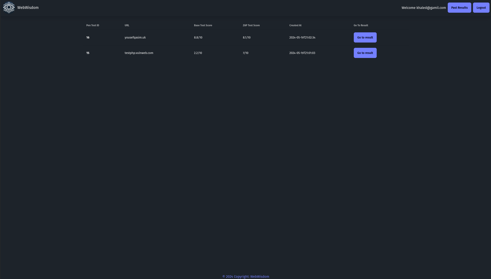
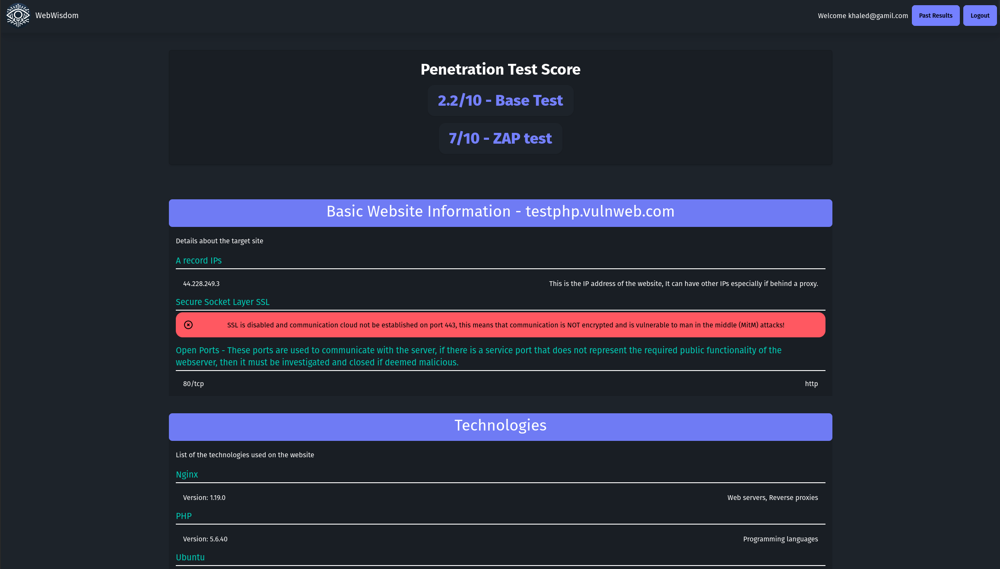
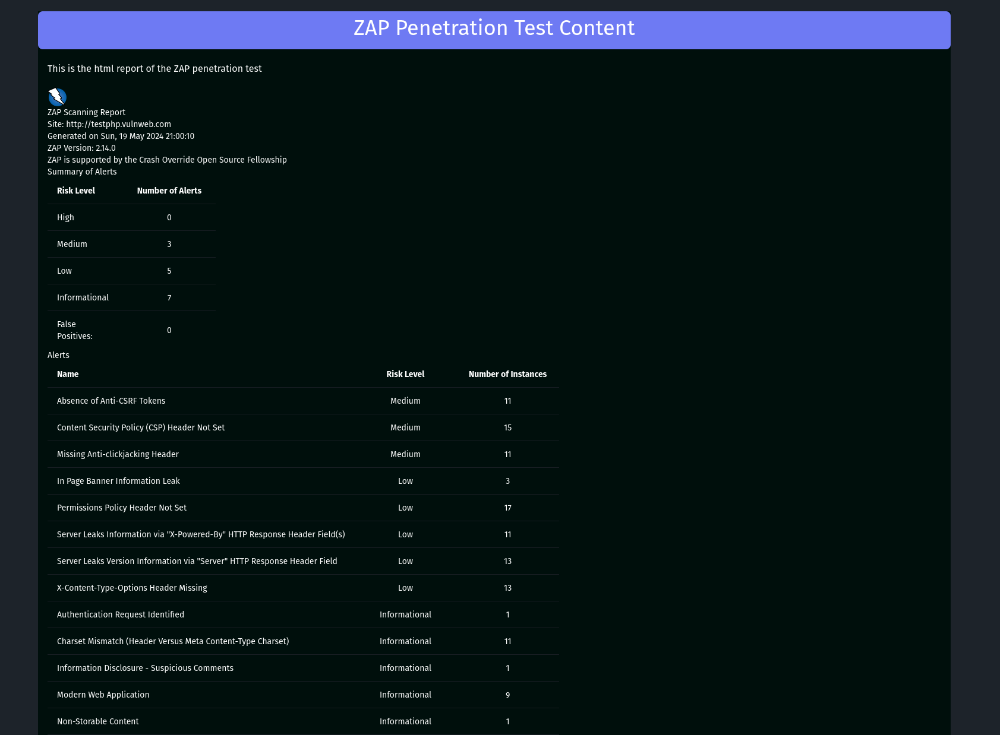

# WebWisdom
A full-stack Fast-API and React tool for automated penetration testing of publicly available websites.
Disclaimer: Only use this tool on websites and domains that you own

## Example of a penetration test

### Past Results of the current logged-in user



### Penetration Test on a vulnerable domain with purposeful exploits (http://testphp.vulnweb.com/)



This domain is susceptible to exploits and the low score of the base test reflects that information  

### The base test can display the existing technologies running on the domain's server


### The vulnerable software running on the server, we can use this information to learn more about the server's exploits and how to utilize them


### Additional penetration tests will be displayed (if their respective backend and frontend code is added)




# IMPORTANT
When registering a new user in the React frontend, please follow these password rules:

Must be longer than 8 characters and less than 25
At least 1 uppercase letter
At least 1 lowercase letter
At least 1 number
At least 1 special character from this list: !£$%^&*_@~#?

Example of a valid password:  123Rock123???

Must use a valid email syntax
Email can be fake as long as it follows the correct syntax
For Example: user@gmail.com

## Allowed Domains to test this tool on

testphp.vulnweb.com


# Installation and Deployment
## Requirements
Linux Operating System

Poetry

NPM

Node

Python 3.10.x

Docker 

```bash
docker pull ghcr.io/zaproxy/zaproxy:stable
```

Nmap

```bash
pip install ptt
```


## Steps
Clone the repository:
```bash
git clone https://github.com/KhaledQasim/WebWisdom.git
```
### Fast-API Backend
```bash
cd WebWisdom/backend/WebWisdom
```
Get Fast-API dependencies 
```
poetry install
```
Navigate inside the poetry virtual environment
```
poetry shell
```
```
cd webwisdom
```
Create a .env file in this directory and populate it with the following content
```text
SECRET_KEY="run below command"
ALGORITHM="HS256"
ACCESS_TOKEN_EXPIRE_MINUTES=2880
ALLOWED_FRONTEND_URL="http://127.0.0.1:5174"
```
To Generate a secret key run the below command then copy the output with no spaces and place it a string value for the .env variable "SECRET_KEY"
```bash
openssl rand -base64 64
```
Then start the Fast-API uvicron server
```
poetry run uvicorn webwisdom.main:app --port 8000 --reload
```
If port 8000 is already being used then you must kill the program using it so univron can use it instead


### React Frontend
In a new terminal
Navigate into this directory `WebWisdom/frontend`
Run this command to install the frontend react dependencies 
```bash
npm install
```
Then create a .env file and populate it with the following information
```
VITE_BACKEND_URL="http://127.0.0.1:8000"
```
Then build the frontend
```
npm run build
```
Then preview the build
```
npm run preview
```
Click the "Register" button at the top right of the Navbar and follow the rules mentioned at the start of this file for creating a new user with the correct password and email.

# Testing
Install Pytest using pip
Navigate to `/WebWisdom/backend/WebWisdom` directory
Open a terminal in the directory and run these commands

```
poetry shell
```

then

```
pytest -v -s
```


